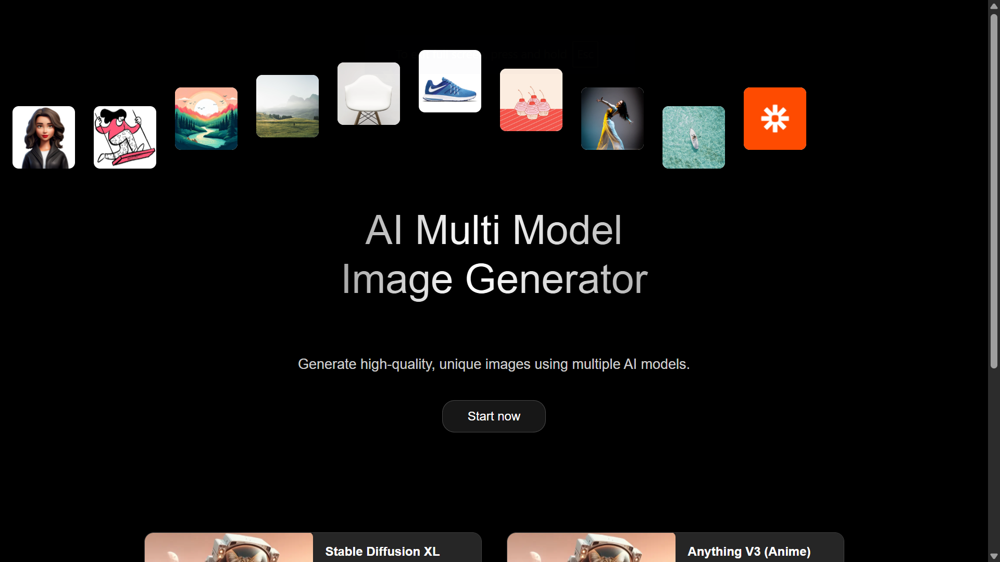
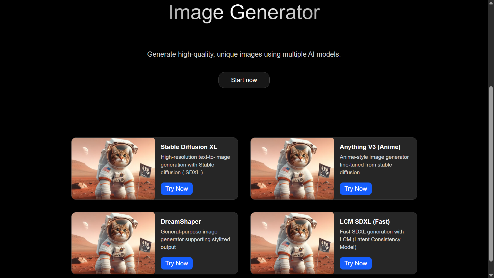
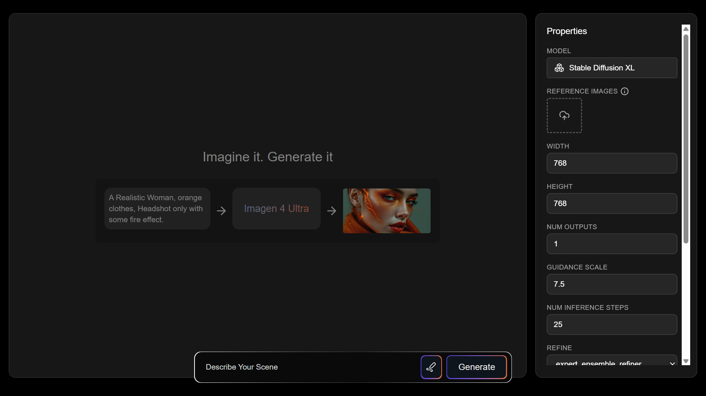

# AI Tool Explorer 🤖

A modern Next.js application that allows users to explore, interact with, and run AI models from Replicate's extensive collection. Built with a focus on clean architecture, intuitive user experience, and Good UI/UX.

## 🎯 Overview

AI Tool Explorer provides a seamless interface for discovering and experimenting with various AI models including text-to-image generators and can also be used for language models, and other AI tools . Users can browse available models, read detailed descriptions, configure inputs, and view generated outputs in real-time.

## ✨ Features

### 🔍 Model Explorer

- Browse a curated collection of 4 popular AI models from Replicate
- View model cards with names, descriptions, and Images
- Quick access to try any model with a single click

### 📱 Model Detail Pages

- Dynamic routing (`/model/[slug]`) for individual model experiences
- Model Info and name
- Dynamic form generation based on model schema
- Clean output display for generated content

### 🚀 Model Runner

- Secure API integration with Replicate
- Can support various output types (images, text, videos)
- Error handling with user-friendly messages

### 🎨 User Experience

- Responsive design following provided Figma specifications
- Loading states with spinners and progress indicators
- Clean, modern UI built with Tailwind CSS
- Intuitive navigation and user flow

## 🛠️ Tech Stack

- **Framework**: Next.js 14+ (App Router)
- **Styling**: Tailwind CSS
- **State Management**: React hooks (useState, useEffect)
- **API Integration**: Replicate API
- **TypeScript**: Full type safety
- **Deployment**: Vercel

## 📁 Project Structure

```js
src/
├── app/
│   ├── api/
│   │   └── generate/
│   │       └── route.ts          # API route for model inference
│   ├── model/
│   │   └── [slug]/
│   │       └── page.tsx          # Dynamic model detail pages
│   ├── favicon.ico
│   ├── globals.css               # Global styles
│   ├── layout.tsx                # Root layout component
│   └── page.tsx                  # Home page with model explorer
├── components/
│   ├── LoadingSpinner.tsx        # Reusable loading component
│   ├── ModelCard.tsx             # Model preview card
│   ├── ModelForm.tsx             # Dynamic form for model inputs
│   └── OutputDisplay.tsx         # Output rendering component
└── lib/
    ├── models.ts                 # Model definitions and configurations
    └── replicate.ts              # Replicate API client setup
```

## 🚀 Getting Started

### Prerequisites

- Node.js 18+
- npm or yarn
- Replicate API token

### Installation

1. **Clone the repository**

   ```bash
   git clone <repository-url>
   cd ai-tool-explorer
   ```

2. **Install dependencies**

   ```bash
   npm install
   # or
   yarn install
   ```

3. **Set up environment variables**

   ```bash
   cp .env.example .env.local
   ```

   Add your Replicate API token:

   ```env
   REPLICATE_API_TOKEN=your_replicate_token_here
   ```

4. **Run the development server**

   ```bash
   npm run dev
   # or
   yarn dev
   ```

5. **Open your browser**
   Navigate to [http://localhost:3000](http://localhost:3000)

## 🔧 Configuration

### Environment Variables

Create a `.env.local` file with the following variables:

```env
REPLICATE_API_TOKEN=your_replicate_token_here
NEXT_PUBLIC_APP_URL=http://localhost:3000
```

### Supported Models

The application currently supports these AI models:

- **Stable Diffusion XL** - High-resolution text-to-image generation with Stable diffusion ( SDXL )
- **Anything V3** - Anime-style image generator fine-tuned from stable diffusion
- **Dreamshaper** - General-purpose image generator supporting stylized output
- **LCM SDXL** - Fast SDXL generation with LCM (Latent Consistency Model)

## 💡 Key Design Decisions

### Architecture Choices

1. **App Router**: Utilized Next.js 13+ App Router for improved performance and developer experience
2. **Server Components**: Leveraged server-side rendering where appropriate for better SEO and performance
3. **API Routes**: Implemented secure server-side API calls to protect the Replicate token
4. **Component Modularity**: Created reusable components for forms, cards, and output display

### State Management

- **Local State**: Used React hooks for component-level state
- **Loading States**: Implemented comprehensive loading, error, and success states
- **Form Handling**: Dynamic form generation based on model schemas

### User Experience

- **Responsive Design**: Mobile-first approach with Tailwind CSS
- **Error Boundaries**: Graceful error handling throughout the application
- **Loading Indicators**: Clear feedback during API calls

## 🎨 UI/UX Features

- **Loading Spinners**: Custom loading components with smooth animations
- **Form Validation**: Real-time input validation and feedback
- **Responsive Layout**: Optimized for desktop, tablet, and mobile devices

## 📊 Performance Optimizations

- **Image Optimization**: Next.js automatic image optimization
- **Code Splitting**: Automatic code splitting with App Router

## Screenshots





## 🚀 Deployment

### Vercel Deployment

1. Connect your GitHub repository to Vercel
2. Add environment variables in Vercel dashboard
3. Deploy automatically on push to main branch

### Manual Deployment

```bash
npm run build
npm start
```

## 📝 Usage Examples

### Running a Text-to-Image Model

1. Navigate to the home page
2. Select a model (e.g., "Flux Schnell")
3. Enter your prompt in the text field
4. Adjust any additional parameters
5. Click "Generate" and wait for results

### API Usage

```typescript
// Example API call to generate endpoint
const response = await fetch('/api/generate', {
  method: 'POST',
  headers: {
    'Content-Type': 'application/json',
  },
  body: JSON.stringify({
    model: 'flux-schnell',
    input: {
      prompt: 'A beautiful sunset over mountains',
      // ... other parameters
    }
  })
});
```

## 🤝 Contributing

1. Fork the repository
2. Create a feature branch (`git checkout -b feature/amazing-feature`)
3. Commit your changes (`git commit -m 'Add amazing feature'`)
4. Push to the branch (`git push origin feature/amazing-feature`)
5. Open a Pull Request

## 📞 Support

For support and questions:

- Create an issue in the GitHub repository
- Check the [Replicate documentation](https://replicate.com/docs)
- Review the [Next.js documentation](https://nextjs.org/docs)

---

### Built by Vinayak using Next.js and Replicate API
